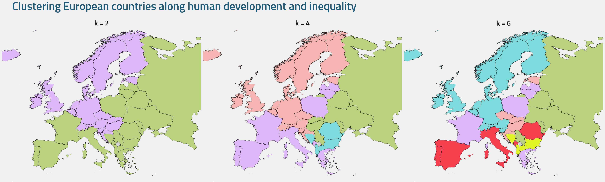
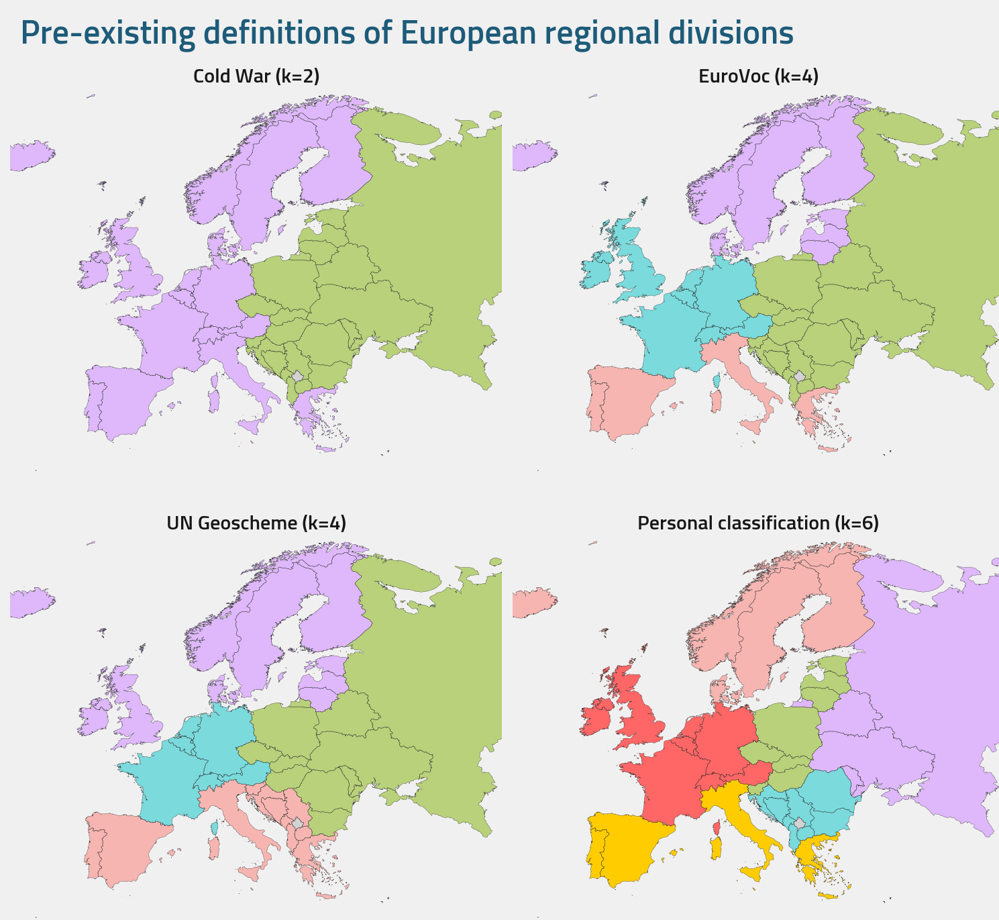

# clustering-europe

Categorising Europe into regional divisions is as much determined by political history as it is by geography. Is Greece, a country further east than the Czech Republic, in Western Europe? Popular conceptions rooted in Cold War history would say it is. And what of Estonia? Geographically it could be considered Northern Europe, whereas economically it resembles its western counterparts more than its eastern neighbours. Yet its five decades as part of the Soviet Union often leads it to be considered a part of Eastern Europe.

If we ignored geographic information, how far can just social and economic factors go in determining a coherent regional classification of European countries? **In this project, we use *k*-means clustering to categorise European countries based on the distribution of  two variables, human development and inequality.** We then compare how the results of our geographically-agnostic, unsupervised clustering methodology align with pre-existing definitions of European regional divisions.

## Background
The variables we use here, human development and inequality, together compose the UN's [inequality-adjusted Human Development Index (IHDI)](https://en.wikipedia.org/wiki/List_of_countries_by_inequality-adjusted_Human_Development_Index). "Human development" is calculated as an average of three factors: income per capita, life expectancy and years of schooling. "Inequality" uses a measure called the Atkinson index to calculate inequalities across these three outcomes in the form of a "loss percentage". This percentage is subtracted from the country's human development score to produce the IHDI. For example, a country with 0.80 HDI and 20% inequality results in an IHDI score of 0.64 for that country. 

The Atkinson index is distinguished from other inequality metrics, like the Gini coefficient, in that it incorporates the assumption of diminishing marginal utility. Have a look at [**this repository**](https://github.com/tigran-sog/inequality-metrics) to explore how the Atkinson index is calculated and how it reacts to differently shaped income distributions.

## Results
### Determining *k*
Given that the amount of input variables we use for the clustering (human development and inequality) is two, the choice of four clusters seems the most sensible *a priori*. This way, clusters can be easily interpreted as belonging to one of four combinations of the two variables: "less developed and less equal", "less developed and more equal", "more developed but less equal", "more developed and more equal".

We can also qualitatively arrive at the best *k* for our input data. By computing both the sum of the squared errors (SSE) and sillhouette coefficients over each *k*, an optimum of four clusters indeed strikes the best balance between simplicity and capturing variation:

Although it's clear that *k* = 4 is the best fit for our input data, any *k* from 2 to 6 appears both acceptable quantitatively and reasonable in application to our task of dividing Europe into a handful of meaningful regions. So let's focus on an optimal sorting of European countries into four clusters, and also observe the results for two and six clusters as comparisons. 

### European clusters according to *k* = 2, 4 and 6

Observing the map of the optimal configuration of 4 clusters, we can see that the countries within each cluster generally share borders and form contiguous blocs, with the exception of the purple cluster which is split between Southern Europe and the Baltic region. Overall, an interpretable pattern emerges with Western Europe and Northern Europe (in addition to Greece) characterised as countries with high human development, which in turn are internally split with more inequality in the Mediterannean and southern coast of the Baltic Sea. Conversely, Eastern Europe is characterised with lower human development, with much of the Balkans exhibiting higher inequality than the countries to the north and northeast of them.

### Comparing to pre-existing regional divisions of Europe 

Although we find a degree of spatial autocorrelation and contiguity in our optimal four cluster configuration, the generated clusters also produce some geographic outliers. One persistent patterns across each three of the *k* configurations is that the Baltic countries tend to be grouped with France, for example.

In comparison, let's introduce four ways of categorising the nations of Europe which holistically take into account geography, history and culture. Three of these configurations, "Cold War", "EuroVoc" and "UN Geoscheme", are well known or are widely used by international organisations. The fourth is my own, personal, six-way division based on countries' political histories and geographic positions.

We can use quantitiative measures to evaluate how closely our *k*-means clustering results align with these pre-existing regional divisions of Europe. One such measure is the **Adjusted Rand Index (ARI)**. It's a measure of the similarity between the clustering sets and the pre-existing classes we are comparing them to: a value of 1 indicates perfect agreement, whereas a value of -1 indicates perfect disagreement. A second score we can use is the **V-measure**, which looks at both the homogeneity and the completeness of each cluster set, evaluating how well each cluster contains only members of one class - and the opposite.

| Definition   | *k*-means cluster set   |   ARI |   V-measure |
|:-------------|:--------------|------:|------------:|
| Cold War     | *k* = 2            |  0.17 |        0.14 |
| UN Geoscheme | *k* = 4            |  0.18 |       0.31 |
| EuroVoc      | *k* = 4            |  0.16 |       0.39 |
| Personal     | *k* = 6            |  0.35 |        0.6  |

We can see from this table that, quantitatively speaking, our clusters only map somewhat well to the pre-existing regional divisions.

Interestingly, with an ARI of 0.17 and a V-measure of 0.14, the Cold War definition is the most incongruous with our socioeconomic-based clustering approach. This suggests that a simple two-way division of European countries can't be served well by relying on 20th century political history -- former Eastern Bloc countries such as Estonia, Slovenia, Czechia, Slovakia, Hungary and Croatia share more in common with Western European countries in terms of their socioeconomic development and the way this development is distributed.

The two four-way definitions, EuroVoc and the UN's Geoscheme, are geographically intuitive, showing more geographic contiguity than our *k* = 4 clustering results. But the weak agreement with our results also indicates that they group together countries with drastically different socioeconomic outcomes (such as the Balkan countires like Serbia, Bosnia and Herzogivna and Albania, with Spain, Portugal and Italy).

The two four-way definitions, EuroVoc and the UN's Geoscheme, also show only a weak agreement with our optimal *k* = 4 clusters. Although they themselves are geographically intuitive, the results indicate that these definitions group together countries with drastically different socioeconomic outcomes. For example, the UN Geoscheme groups much poorer Balkan countries like Serbia, Bosnia and Albania with Spain, Portugal and Italy into a common Southern Europe category. On the other hand, EuroVoc partially replicates the Cold War understanding of Eastern Europe, pooling former Eastern Bloc countries like Czechia and Albania together, despite the gulf in both human development and inequality between them.

## Conclusion

Performing *k*-means clustering on the human development and inequality of European countries brings forth two key findings.

Firstly, we find that commonly used or pre-existing definitions of European regional divisions have a tendency to pool together countries that are not necessarily similar in the level of their development or the distribution of their welfare. This is not surprising given that such definitions are based primarily on geographic, cultural or historical factors over socioeconomic ones. But it does suggest that such cultural or historical factors (like whether the nation experienced communist rule during the 20th century) are not necessarily as determinant of contemporary socioeconomic outcomes as may sometimes be presumed. Within the former Eastern Bloc countries, there is spectrum of socioeconomic standing - from highly developed and equal countries like Czechia and Slovenia, to less developed but equal countries like Belarus and Ukraine, as well as less developed and more unequal countries like Bulgaria and North Macedonia. This may reflect divergences in the economic trajectories of those countries since the end of communism, but may also preserve the effects of historical influences that pre-date communism.

Emerging from this, the second key finding is that there is still a surprising amount of geographic structure in these two socioeconomic variables alone. Countries with similar combinations of human development and inequality tend to neighbour each other, as seen with some of the examples mentioned above. These contiguities are not perfect -- we find that France and some southern European countries persistently cluster with countries on the Baltic coast, like Poland and Lithuania. But a strong spatial autocorrelation is evident ovverall when *k* = 2 or 4. As these geographically contiguous groupings do not necessarily reflect common understandings of the regional divisions of Europe, this invites us to look at the mosaic of 21st century Europe in a different light.

## Repository
### /code/
- **main.py**  - Code for *k*-means clustering and visualisations 
- **mapping.py** - Mapping of *k*-means clustering results
### /data/
- **IHDI dataset 2022 Europe.csv** - Input dataset containing European countries according to pre-existing regional definitions
- **european clusters.csv** - Output dataset containing results of *k*-means clustering
- **/borders/** - Shape files for global sovereign states (for use in `mapping.py`)